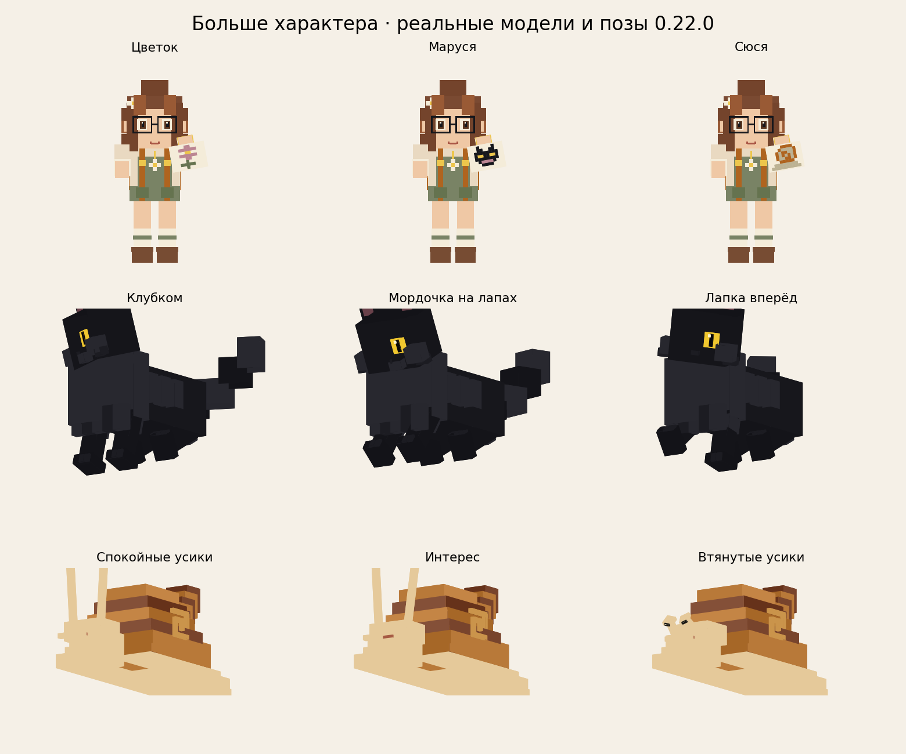
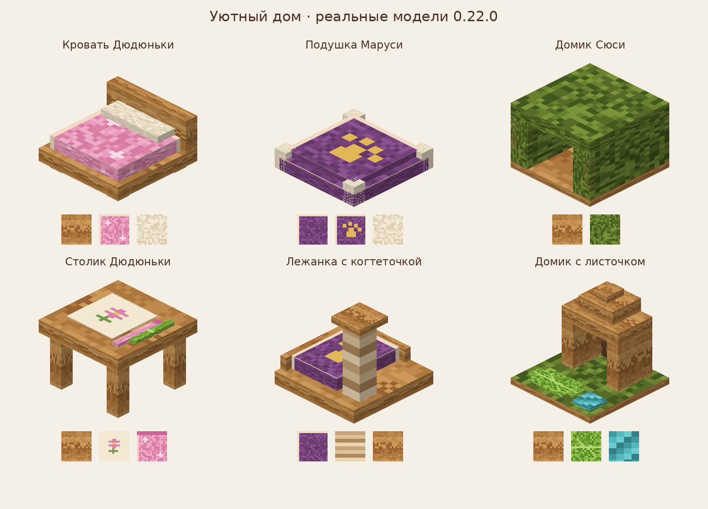
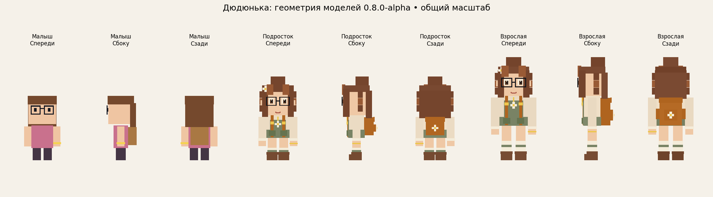
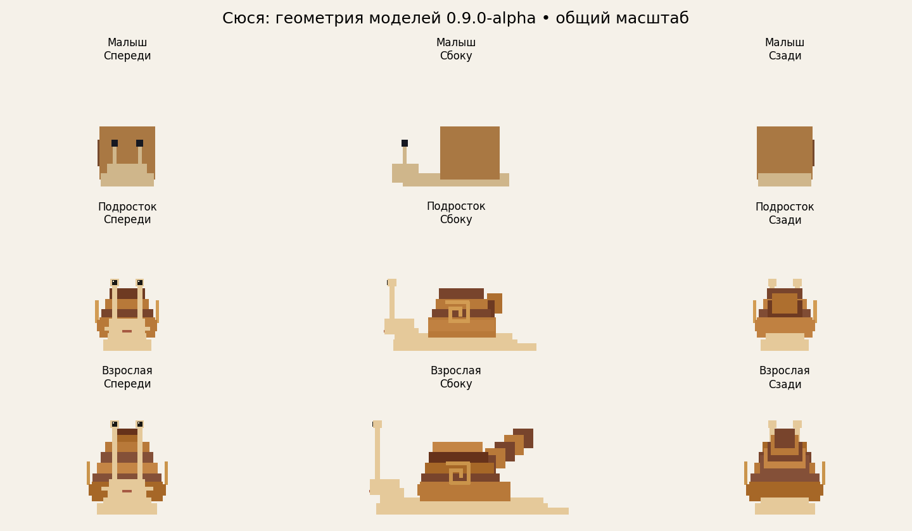
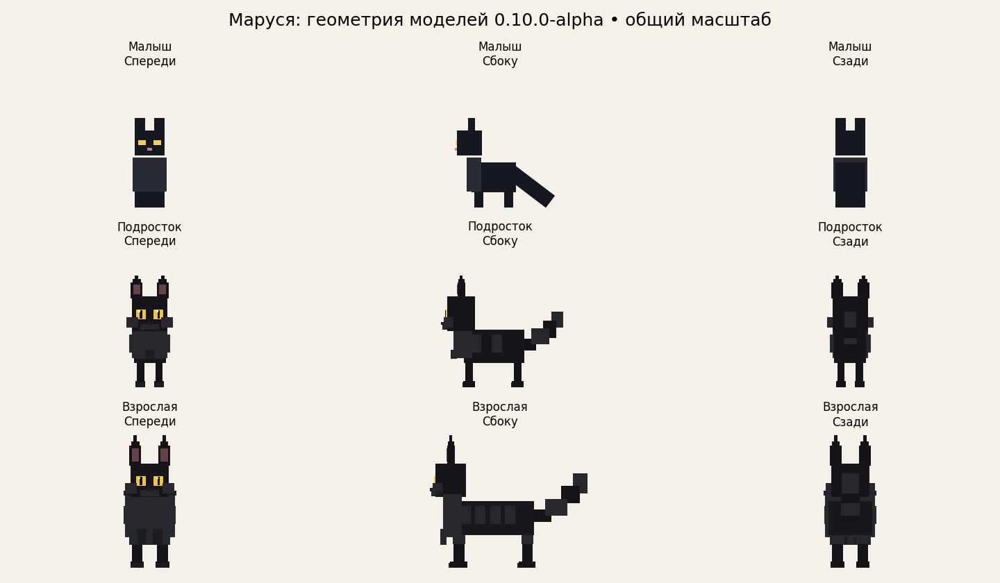

# Dudunka Family — 0.25.0 alpha (рабочая ветка)

Эта ветка содержит приветствия после путешествия и дождливые домашние сценки. **JAR 0.25.0-alpha еще не опубликован.** Последний локальный прогон: 133/134, все десять новых тестов прошли; финальная проверка этой сохраненной ветки ожидает восстановления среды сборки.

[Механики и как попробовать](docs/HOME-ATMOSPHERE.md) · [Проверки и точка продолжения](docs/VALIDATION-0.25.0-WIP.md).


Целевая сборка: **Better MC [FORGE] BMC4, Minecraft 1.20.1, v55.5, Forge 47.4.13**.
Версия Forge подтверждена в manifest.json официального архива v55.5 (CurseForge file 7443284).

## Исправление ошибки поедания яблока

В 0.2.0-alpha и 0.3.0-alpha возможна ошибка `FamilyBehaviorGoal.tick`: повторный тик после поедания яблока обращается к уже очищенной цели. Исправлено в 0.2.1-alpha и 0.3.1-alpha. Для продолжения проверки поведения 0.2 используйте [0.2.1-alpha](https://github.com/GolovinSS/dudunka-minecraft-mod/raw/main/dist/dudunka-0.2.1-alpha.jar); домашние места и переноска в нее не добавлены. Замените предыдущий JAR, оставьте в mods один файл Dudunka Family.

## С чего начать

[Простая инструкция для детей: как найти яйца, вырастить друзей и устроить им дом](docs/QUICK-START-KIDS.md).

## Статус

Три персонажа с отдельными моделями малыша, подростка и взрослого, заботой, доверием, домашними местами и семейными занятиями. Возрастные модели сделаны по предоставленным референсам; модели малышей сохранены. Художественная приемка и проверка анимаций в игре продолжаются.

Факт компиляции и доступные проверки см. `docs/VALIDATION.md`. Совместимость с полной сборкой BMC4 пока не подтверждена игровым запуском.

## Последние версии

| Версия | Что добавлено | Проверки | Скачать |
|---|---|---|---|
| **0.24.0-alpha** | Совместные прогулки у цветов и необязательные просьбы; памятные подарки, воспоминания и сохранение прогресса | [Проверки](docs/VALIDATION.md) · [Как попробовать](docs/WALKS-AND-REQUESTS.md) | [JAR 0.24.0-alpha](https://github.com/GolovinSS/dudunka-minecraft-mod/raw/refs/heads/main/dist/dudunka-0.24.0-alpha.jar) |
| **0.23.0-alpha** | Совместные сценки у мебели: гости смотрят рисунок, отдыхают рядом с Марусей и наблюдают за Сюсей; подтвержденное совместное время укрепляет дружбу | [Проверки и ограничения](docs/VALIDATION-0.23.0.md) | [JAR 0.23.0-alpha](https://github.com/GolovinSS/dudunka-minecraft-mod/raw/refs/heads/main/dist/dudunka-0.23.0-alpha.jar) |
| **0.22.1-alpha** | Кнопка «Как играть» в альбоме: пять коротких страниц для детей, прокрутка и возврат к прежней странице; русский и английский текст, протокол 7 сохранён | Сборка и проверки моделей; игровой GUI ещё не проверен | [JAR 0.22.1-alpha](https://github.com/GolovinSS/dudunka-minecraft-mod/raw/refs/heads/main/dist/dudunka-0.22.1-alpha.jar) |
| **0.22.0-alpha** | Три рисунка Дюдюньки, три позы отдыха Маруси, реакции усиков Сюси; шесть новых записок и две личные истории; исправлен повторный подход к мебели | [102/102 GameTests и проверки девяти возрастных моделей](docs/VALIDATION-0.22.1.md) | [JAR 0.22.0-alpha](https://github.com/GolovinSS/dudunka-minecraft-mod/raw/refs/heads/main/dist/dudunka-0.22.0-alpha.jar) |
| **0.21.0-alpha** | Новые модели и текстуры домашних мест; столик, лежанка с когтеточкой и домик с листочком; назначение мебели через альбом, режим «Дома» и занятия друзей | [95/95 GameTests](docs/VALIDATION-0.21.0.md) | [JAR 0.21.0-alpha](https://github.com/GolovinSS/dudunka-minecraft-mod/raw/refs/heads/main/dist/dudunka-0.21.0-alpha.jar) |

Для обновления используй **0.23.0-alpha**: она включает предыдущие изменения 0.21–0.22.1. Замени JAR на сервере и всех клиентах, оставив в `mods` один файл Dudunka Family. Протокол альбома изменился с **6** на **7**; старые миры, привязки и прочитанные записки сохраняются. Игровая приемка в полной BMC4 остается открыта.

## Сборка

Нужен **JDK 17** и доступ к Maven Forge, Gradle и серверам Mojang.

Ubuntu / macOS:

```bash
chmod +x gradlew
./gradlew build
```

Windows PowerShell:

```powershell
.\gradlew.bat build
```

Результат: `build/libs/dudunka-0.23.0-alpha.jar`. Использовать обычный JAR, не sources и не dev.

## Установка

1. Создать копию профиля Better MC **v55.5** и копию мира для первого теста.
2. Открыть папку этого профиля и положить JAR в `mods`. Оставить только один JAR Dudunka Family; предыдущие версии из `dist` не устанавливать.
3. Оставить Forge **47.4.13**, указанный сборкой. Дополнительные библиотеки для мода не требуются.
4. При игре на выделенном сервере положить тот же JAR и на сервер, и на каждый клиент.
5. Запустить тестовый мир. Предметы находятся во вкладке «Семья Дюдюньки».

## Характер и истории (0.22.0-alpha)

Дюдюнька по очереди рисует **цветок, Марусю и Сюсю**: рисунок на столе совпадает с листом в руке. Маруся чередует отдых клубком, с наклонённой к лапам мордочкой и вытянутой лапкой. Усики Сюси спокойно покачиваются, оживляются при интересе и втягиваются при отдыхе, укрытии или намокании. Альбом показывает текущий вариант.

Добавлены **шесть записок и две маленькие истории**: «Кошка, которая выбрала дом» и «Большое путешествие маленькой Сюси». Все записки встречаются в сундуках домов обычных деревень; есть дополнительные места поиска. Прочитай найденную записку ПКМ: она сохранится лично для тебя в разделе «Где искать яйца», даже если найдена не по порядку. Истории необязательны, наград не дают и не меняют шансы яиц, рост или доверие.



Это превью реальной геометрии и текстур, не игровой снимок. Механика и места поиска: [CHARACTER-STORIES.md](docs/CHARACTER-STORIES.md). Протокол альбома **7**: обнови сервер и все клиенты.

## Уютный дом (0.21.0-alpha)

Домашние места получили новые модели и собственные пиксельные текстуры: маленькая кроватка Дюдюньки, подушка Маруси с лапкой и моховое укрытие Сюси. Существующие ID, владельцы и привязки сохраняются; старые блоки смотрят на север, новые ориентируются при установке.

Добавлены три необязательных предмета мебели: **Столик Дюдюньки**, **Лежанка Маруси с когтеточкой**, **Домик Сюси с листочком**. Их можно скрафтить или взять в творческой вкладке. Поставь мебель под крышей рядом с готовым домашним местом, оставь проход перед входом и свободное внутреннее пространство.

Открой альбом → «Моя семья» → выбери друга → **Назначить мебель** → **Дома**. Назначается ближайшая свободная мебель соответствующего вида в области ±4 блока по сторонам домашнего места, не дальше 8 блоков от игрока. На мебели один друг; чужую мебель назначить нельзя. «Освободить» снимает привязку; Shift+ПКМ по своей мебели с альбомом освобождает ее даже при выгруженном друге.

В режиме «Дома» персонаж остается около своего дома: Дюдюнька рисует и показывает лист с цветком, Марусей или Сюсей; Маруся потягивается, точит когти и сворачивается с мурчанием; Сюся заползает в домик, отдыхает, выглядывает и выходит к листочку. Занятие длится до 12 секунд после подхода, затем действует пауза 10 секунд. «Следовать» и «Ждать здесь» переключают режим обратно. Препятствия, вода, поводок, транспорт, потеря дома или мебели отменяют занятие. Лист, карандаши, рисунок и вода — декор: предметы не производятся и угощения не заменяются. Рост, доверие, поиск яиц и дружба сохраняют текущие правила.



Превью построено из настоящих JSON-моделей и PNG-текстур; это не снимок из игры. Подробности, рецепты и ограничения: [COZY-HOME.md](docs/COZY-HOME.md).

## Как играть

Яйца в выживании не крафтятся и не призывают персонажа мгновенно. Их нужно поставить как блок и подготовить условия.

| Яйцо | Где найти (шанс на сундук) | Угощение: ПКМ по яйцу | Окружение в пределах 2 блоков |
|---|---|---|---|
| Сюси | Обычные подземелья, 15%; природные яйца в новых болотах и lush caves (см. ниже) | Один блок листьев + один красный/коричневый гриб | Яйцо на траве или мху, рядом вода |
| Маруси | Шахты и лесные особняки, 8% | Одна сырая треска или лосось | Шерсть или ковер, местная освещенность ≤ 7 |
| Дюдюньки | Сундуки домов пяти обычных типов деревень, 4% | Один хлеб + одно яблоко + одно печенье | Кровать и светящийся блок (например, факел) |

Угощение потребляется при первом добавлении каждого требуемого типа. Первое угощение закрепляет яйцо за игроком; другой игрок не сможет его кормить. В творческом режиме предметы не расходуются. ПКМ показывает число угощений и прогресс. При неподходящих условиях таймер приостанавливается и продолжится после восстановления условий.

Вылупление: **5 минут** загруженного времени. После вылупления домом считается место яйца. Рост: малыш → подросток за **20 минут**, затем взрослый еще через **20 минут**. Выгруженные чанки не ускоряют таймер. Обычные таймеры и поведение не загружают чанки; явный возврат через альбом временно загружает только последний сохраненный чанк персонажа. Подробнее — в разделе 0.19 ниже.

Любимая еда: Дюдюнька — хлеб, яблоки, печенье; Маруся — сырая рыба; Сюся — листья, грибы, яблоки. Кормление: ПКМ, не чаще раза в 30 секунд; +5 доверия, восстановление 4 HP, ускорение роста на 30 секунд. Стадия, доверие, хозяин, дом и таймеры сохраняются.

**Shift + ПКМ пустой рукой** переключает «Жду здесь / Гуляю с тобой». Маруся примерно один интервал из пяти предпочитает гулять сама (интервалы по 10 секунд), остальные следуют за хозяином. Семья останавливается, если ее Сюся отстала на 4–12 блоков; ждать чужую Сюсю не будет. Сюся действительно медленнее остальных. Персонажи не атакуют и не забирают предметы из сундуков.

При смертельном обычном уроне здоровье восстанавливается и персонаж пытается вернуться к безопасной позиции около дома, если домашний чанк загружен в том же измерении. После этого 10 секунд защиты. Если безопасное место недоступно, персонаж остается на месте. Административная команда `/kill` работает. Автоматического возврата при смерти, после `/kill` или при смене измерения нет; свой существующий персонаж из другого измерения или выгруженного чанка можно явно вернуть через альбом (см. раздел 0.19).

**Не ломайте яйцо во время выращивания**: выпадет обычное яйцо, но угощения, хозяин и таймер сбросятся. Чужой игрок не может сломать закрепленное яйцо через обычное разрушение блока; оператор в творческом режиме может. Яйца и домашние места не двигаются поршнями и имеют высокую взрывоустойчивость. Это не защита от команд или произвольного вмешательства других модов.

## Быстрый тест с командами

В творческом мире с разрешенными командами:

```mcfunction
/give @s dudunka:dudunka_egg
/give @s dudunka:marusya_egg
/give @s dudunka:syusya_egg
```

Сначала поставьте и вырастите яйца: прямой `/summon` создает бесхозного персонажа и предназначен только для отладки модели.

Настройки отдельного мира: `saves/<мир>/serverconfig/dudunka-server.toml`; на сервере `<мир>/serverconfig/dudunka-server.toml`. После первого запуска можно закрыть игру и изменить `hatchSeconds` и `growthStageSeconds` на `10` для быстрого теста. Стандартные значения 300/1200; `eggLootMultiplier = 1.0`.

## Ограничения совместимости

Мод использует отдельное пространство имен `dudunka`, стандартные цели AI и серверную логику. Нет mixin, coremod, GeckoLib и замены ванильных классов. Лут добавляется Forge Global Loot Modifiers с `replace: false`. Это уменьшает риск конфликтов, но не является гарантией совместимости с 393 модами.

Яйца добавляются в указанные ванильные таблицы и в отдельные подтвержденные таблицы MVS и YUNG’s Better Dungeons для целевой сборки BMC4; природные яйца Сюси также могут появляться в новых чанках поддерживаемых биомов BOP. Полный список источников и ограничений — в [docs/BMC-EGGS.md](docs/BMC-EGGS.md). Остальные таблицы структур не включены. Уже сформированные сундуки не получают яйца; еще не сформированная добыча может получить их и в старом мире.

## Новое поведение в 0.2.0

- Дюдюнька иногда поправляет очки. При доверии от 25 может махать своему игроку, если тот рядом. Есть черновые процедурные позы idle, run, sit и sleep.
- Дюдюнька подходит посмотреть на цветы, торт и сундуки в пределах 4 блоков; содержимое сундуков не читает. Лежащее яблоко в пределах 5 блоков может съесть по одному за действие. Учитывается задержка подбора предмета.
- Маруся замечает ближайшего монстра в радиусе 10 блоков, смотрит на него и предупреждает хозяина. Не атакует. Может наблюдать за рыбой в пределах 6 блоков, ночью устраивается на доступной кровати или сундуке.
- Сюся иногда движется к мху, цветам, цветущей азалии или споровому цветку в пределах 6 блоков. Это локальное любопытство, а не поиск биома на карте.
- Дюдюнька и Маруся ждут отставшую Сюсю своей семьи, смотрят на нее и используют позу ожидания. Когда Сюся подойдет на 2,5 блока, ожидание прекращается. Один эпизод ограничен 12 секундами.
- Во время дождя персонажи ищут доступное укрытие в пределах 6 блоков. Ночью Дюдюнька и Сюся возвращаются к координате дома, если она под крышей; в 0.3.0 можно привязать отдельное домашнее место.
- Новые достижения: взросление каждого, «Все дома» (все трое одного владельца рядом в радиусе 8), «Подождите Сюсю!» (6 секунд ожидания), «Это не ерунда» (успешное кормление печеньем), «Кто занял кровать?!» (Маруся устроилась на кровати).

Команда «жди» имеет приоритет над этими действиями. Поиски ограничены ближайшими загруженными чанками; активность передается клиенту и не сохраняется после перезапуска. Дом, владелец, возраст и доверие продолжают сохраняться. Доступность пути зависит от рельефа и стандартной навигации Minecraft.

## Дом и переноска в 0.3.0

«Кровать Дюдюньки», «Подушка Маруси» и «Домик Сюси» — личные домашние места. Рецепты есть в JEI: три блока розовой/фиолетовой шерсти или мха над тремя досками. Это маркеры дома; отдельно нужна обычная кровать для сна игрока.

Поставьте место под крышей. В пределах 4 блоков по горизонтали и от 1 блока ниже до 3 выше нужны: обычная кровать, сундук или бочка, светящийся блок и поставленный торт. Содержимое сундуков не читается. ПКМ по месту сообщает недостающие условия или привязывает своих персонажей нужного вида в пределах 8 блоков. Один дом может обслуживать несколько своих персонажей одного вида. Владелец записывается при установке; чужой игрок не привяжет и не сломает место. После разрушения/перестройки условия обновляются не позднее чем через 5 секунд; без безопасного пола и пространства возврат не выполняется. До первой привязки сохраняется домашняя координата яйца, в том числе в мирах 0.2.0.

Переноска Сюси: нитка сверху, листья по бокам доски, нижний ряд из досок. ПКМ пустой переноской по своей Сюсе забирает ее; предварительно снимите поводок. ПКМ заполненной переноской по блоку выпускает Сюсю со стороны выбранной грани, если есть безопасный пол и свободное место. Возраст, доверие, UUID, режим ожидания, владелец и исходное измерение дома сохраняются. Переноску можно взять в другое измерение и там выпустить Сюсю; новый дом нужно привязать отдельно.

Сервер хранит действующий билет перевозки: копия заполненного предмета и старый билет после повторного захвата не создают вторую Сюсю. Билет сохраняется в данных мира. Автоматического восстановления при уничтожении/исчезновении переноски нет; она огнестойкая, но остается обычным предметом. Сохранение мира и инвентаря не является единой атомарной операцией при аварии процесса; тест отката поврежденного мира еще нужен.

## Доверие в 0.4.0

Обычный ПКМ пустой рукой по своей Марусе — погладить: +2 доверия (максимум 100), сердечки, звук мурчания и короткая сцена на 2 секунды. Повторно — через 30 секунд загруженного времени. Таймер сохраняется, перезагрузка не позволяет обойти паузу. Shift + ПКМ пустой рукой по-прежнему переключает ожидание; поглаживание ожидающей Маруси не снимает команду «жди». Рост и здоровье от поглаживания не меняются; кормление сохраняет отдельный таймер.

Сюся получает бонус скорости от доверия: +0,5% за каждый пункт, максимум +50%. При стандартной базовой скорости 0,08 это 0,082 на доверии 5, 0,10 на 50 и 0,12 на 100. Это значение атрибута движения, а не измеренная скорость в блоках в секунду. Сюся остается медленнее Дюдюньки и Маруси. Модификатор не заменяет базовую скорость и эффекты других модов, восстанавливается из доверия при загрузке и перевозке и не складывается повторно.

## Любопытство Дюдюньки в 0.5.0

Если хозяин открыл обычный или ловушечный сундук, его Дюдюньки в пределах 8 блоков получают короткую реакцию. Она подходит к доступному месту рядом и смотрит на сундук. Двойной сундук поддерживается. Сцена длится до 5 секунд, заканчивается при закрытии меню/потере цели; повторное открытие вызывает новую реакцию не чаще раза в 20 секунд на персонажа. Ожидание отставшей Сюси, укрытие, ночной отдых и команда «жди» сохраняют приоритет, поэтому реакция может быть пропущена, если Дюдюнька занята ими.

Реакция запускается после фактического открытия серверного меню. Отмененный клик не запускает ее. Мод использует принадлежность меню блокам сундука и не читает слоты/предметы. Бочки, виртуальные меню и произвольные контейнеры других модов не считаются сундуками. Интерес к закрытому сундуку, цветам и лежащим яблокам сохраняется как отдельное обычное поведение.

Поставленный торт в пределах 6 блоков Дюдюнька замечает без случайного выбора и подходит быстрее: множитель навигации 1,35 вместо 1. Для этого требуется безопасное достижимое место рядом. После прибытия смотрит на торт, не съедает его и не меняет число кусочков. Удаление торта/потеря подхода прекращает сцену; после остановки есть пауза перед следующей попыткой. Проверяется ближайший торт; если к нему нельзя подойти, дальние торты не перебираются.

Открытый сундук, пути и текущие сцены не записываются в NBT. При загрузке мира Дюдюнька начнет обычное поведение; возраст, доверие, владелец, дом, переноски и таймер поглаживания сохраняются.

## Природные яйца Сюси в 0.6.0

В новых чанках биомов `minecraft:swamp`, `minecraft:mangrove_swamp` и `minecraft:lush_caves` могут появиться редкие яйца-блоки Сюси. Это дополнительный путь поиска: прежний лут подземелий сохранен. Уже созданные чанки автоматически не обновляются.

Яйцо появляется только в свободном воздухе на блоке мха или травы с водой в пределах 2 блоков. Нужен свободный блок сверху; рядом не должно быть лавы или другого яйца. Генерация не заменяет блоки и не прокладывает проходы сквозь землю. Найденное яйцо бесхозное, без угощений/прогресса. Добавьте листья и гриб — прежние условия и таймер вылупления сохраняются. Первое угощение закрепляет яйцо за игроком; его можно также аккуратно добыть и поставить дома.

В болотах точки выбираются по поверхности; в lush caves — на высотах от −64 до 64, с поиском подходящего пола вниз не более чем на 24 позиции. Начальная настройка: 1 из 16 попыток запускает пакет из четырех случайных точек. Большинство точек могут не подходить; это не обещание яйца в каждом шестнадцатом чанке. Частоту находок еще нужно оценить в реальной генерации BMC4.

Отключение для отдельного мира: `naturalEggGeneration = false` в его `serverconfig/dudunka-server.toml`; после изменения перезапустите сервер/мир. Уже найденные яйца сохраняются. `eggLootMultiplier` продолжает управлять только шансом яиц в сундуках, независимо от природной генерации.

Биомы других модов автоматически не включены. Для настройки модпака можно расширить теги `dudunka:snail_egg_surface` и `dudunka:snail_egg_cave` через datapack; частота и высоты заданы в соответствующих `worldgen/placed_feature` JSON. Не добавлены непроверенные таблицы лута структур Better MC.

## Семейный отдых у костра в 0.7.0

Присядьте (Shift) в пределах 4 блоков от зажженного обычного или синего костра. Если поблизости есть хотя бы два ваших персонажа без команды «жди», они выберут разные безопасные места на расстоянии двух блоков от огня и подойдут пешком. Доступно до восьми мест; нужны свободный проход, сухой твердый пол и пространство для персонажа. Семья другого игрока не присоединяется.

На месте персонажи принимают позу отдыха и смотрят на огонь. Команда «жди», тревога Маруси, ожидание отставшей Сюси и укрытие от дождя имеют приоритет. Отдых прекращается, если хозяин встает/отходит, костер гаснет, место становится опасным или остаётся меньше двух участников. Сцена временная, без телепортации, загрузки дальних чанков и изменения постоянной команды следования. Дружба между персонажами отдельным числовым показателем пока не реализована.

## Возрастные модели Дюдюньки в 0.8.0

Малыш сохраняет прежние модель и palette.png. Подросток и взрослая получают отдельную геометрию и текстуры: кремовая рубашка, зелёный комбинезон, рыжий рюкзак, пучок с ромашкой, очки, кольцо и подвеска. У подростка крупнее относительная голова и компактнее рюкзак; у взрослой длиннее корпус/ноги и есть боковые карманы рюкзака. Это первая игровая адаптация предоставленных трехракурсных референсов, с упрощением мелких деталей.

Общий рост примерно 1,3× / 1,6× от малыша; доли головы, корпуса и конечностей различаются. Размер столкновения Дюдюньки пересчитывается соответственно возрасту, включая первоначальное создание малыша. Выбор модели/текстуры идет по уже синхронизированной стадии; сохранения и таймер взросления не меняются. Возрастные модели Сюси добавлены в 0.9.0, Маруси — в 0.10.0.



Превью показывает реальную запеченную геометрию в общем масштабе, с выборкой цвета в центре каждой грани. Оно не заменяет игровой скриншот: мелкая фактура, освещение и движения требуют клиентской приемки. Подробнее: docs/DUDUNKA-AGES.md.

## Возрастные модели Сюси в 0.9.0

Малыш сохраняет прежнюю геометрию и палитру. У подростка отдельная округлая раковина с небольшим задним завитком, вытянутое тело и средние усики. У взрослой тело длиннее/шире, есть задний кончик, раковина имеет вытянутый конус ахатины, усики длиннее. Песочно-кремовое тело и теплая коричнево-медовая раковина; полосы выражены сильнее у взрослой, на теле добавлены легкие крапинки.

Длина по крайним вершинам составляет 1,3× / 1,7× от малыша. Для Сюси внешнее масштабирование остается 0,55 на всех стадиях: взросление уже заложено в отдельной геометрии. Размер столкновения увеличивается по возрасту отдельно и пересчитывается при создании малыша/загрузке взрослой. Стадия, доверие, скорость от доверия и переноска сохраняют прежние правила.



Это первая упрощенная игровая адаптация референсов. Превью — проекции реальной геометрии с центральным UV цветом грани, без полной фактуры и игрового света. Графическая приемка в BMC4 еще нужна. Подробнее: docs/SYUSYA-AGES.md.

## Возрастные модели Маруси в 0.10.0

Малыш сохраняет прежние модель и palette.png. Подросток — крупная относительная голова, стройный корпус, тонкие лапы, небольшой воротник, пушистые щеки и умеренно густой хвост. Взрослая — длиннее корпус, шире грудь/воротник, массивнее лапы, гуще и длиннее хвост, заметнее кисточки ушей. Черная шерсть и желтые глаза сохраняются; графитовые материалы близки к черному.

Длина самого корпуса, без головы/хвоста, равна 1,35× / 1,8× от малыша. Изменения заложены в геометрию; render scale Маруси теперь 0,55 на всех стадиях, без повторного увеличения. При тревоге выросшая Маруся приподнимает свой изогнутый хвост; прежняя анимация малыша сохранена. Мурчание, поглаживание, доверие и команда «жди» работают по прежним правилам.



У всех трех персонажей теперь есть отдельные модели/текстуры подростка и взрослого. Это первые упрощенные игровые адаптации референсов: художественная приемка и полноценный графический BMC4 еще нужны. Превью — проекции настоящей геометрии, с цветом из центра UV грани. Подробнее: docs/MARUSYA-AGES.md.

## Дружба между персонажами в 0.11.0

У каждой пары ваших персонажей теперь есть отдельная дружба от 0 до 100. Она отличается от доверия к игроку. Во время отдыха у костра, когда оба действительно дошли до своих мест и сидят, дружба растет на 1 пункт за минуту подтвержденного совместного отдыха. Подход к костру, ожидание Сюси, тревога, «жди», дождь и время вне игры не дают очков. Накопленная часть минуты сохраняется между сценами и обычными сохранениями мира.

Для просмотра нажмите ПКМ **обычной книгой** по своему персонажу. В чат выводятся до пяти самых сильных связей: знакомые (0–9), друзья (10–29), близкие друзья (30–69), неразлучные (70–100). Книга не расходуется, доверие и команда «жди» не меняются. Чужой игрок отношения вашей семьи не видит. Загруженные переименованные персонажи показываются с их именами; для отсутствующих используется вид персонажа.

Начиная с 10 пунктов, при следующем сборе у костра персонаж предпочитает место рядом с самым близким другом из уже разместившихся участников. Места остаются разными; свободный безопасный пол, достижимый путь и обход огня обязательны. Если ближайшее место не подходит, выбирается следующее безопасное. Это предпочтение мест у костра, не постоянное следование за другом.

Дружба сохраняется по идентичности персонажей: выпуск той же Сюси из переноски сохраняет ее связи, новое яйцо создает нового персонажа без старых связей. Смерть/исчезновение участника не удаляет историю; она может отображаться как связь с отсутствующим персонажем. Между измерениями рост дружбы не происходит, но уже накопленные отношения доступны после возвращения. Убывания дружбы и других бонусов пока нет.

Подробнее: docs/FAMILY-FRIENDSHIPS.md. Ручная проверка полного BMC4 и дискового перезапуска еще нужна. Модели/текстуры этой версии совпадают с 0.10.0.

## Следующие этапы

См. `docs/CONCEPT.md` и `docs/TESTING.md`. Открыты интеграция с подтвержденными структурами Better MC, художественная доработка моделей, расширение домашних сцен и надежный возврат при выгрузке чанка. Предыдущие JAR остаются в dist для текущей игровой приемки.

## Домашние сцены (0.12.0)

У привязанного обустроенного дома, пока хозяин рядом: вечером Маруся ложится на свободную кровать раньше игрока, Дюдюнька присаживается у цветов, Сюся рассматривает растения. Команда «ждать», уход/сон хозяина и исчезновение цели прерывают сцену. Сцены короткие, без расходования вещей и телепортации. Подготовка дома и правила: [HOME-SCENES.md](docs/HOME-SCENES.md).

## Приветствие дома (0.13.0)

При доверии от 25 Дюдюнька узнает возвращение хозяина: после не менее 10 секунд дальше 12 блоков от привязанного домашнего маркера и возвращения в радиус 8 блоков она машет ему 4 секунды. Для жеста хозяин должен быть виден и находиться в пределах 6 блоков от Дюдюньки. Повторное приветствие — не чаще раза в минуту и только после нового выхода. Короткие движения у порога, вход в мир и выгрузка чанка не дают ложного возвращения. Команды и срочные реакции сохраняют приоритет. Подробнее: [HOME-SCENES.md](docs/HOME-SCENES.md).

## Семейный альбом (0.14.0)

Книга + бумага + чернильный мешок дают альбом. ПКМ открывает страницы своих загруженных персонажей в радиусе 64 блоков в текущем мире: возраст, доверие, режим, готовность дома и дружба. Колесо прокручивает, стрелки листают. Предмет не расходуется; повторное открытие обновляет сведения. Подробности: [FAMILY-ALBUM.md](docs/FAMILY-ALBUM.md).

## Догоняние в путешествии (0.15.0)

Во время следования в одном мире, в пределах 64 блоков, сильно отставший персонаж после шести секунд отсутствия продвижения может переместиться на проверенное свободное место рядом с хозяином. Движущаяся по достижимому пути Сюся сохраняет медлительность; «ждать», поводок, транспорт и срочные занятия запрещают догоняние. Отключается настройкой `familyCatchUp`. Чанки не загружаются и порталы не пересекаются. Подробности: [FAMILY-TRAVEL.md](docs/FAMILY-TRAVEL.md).

## Команды из альбома (0.16.0)

На странице своего персонажа доступны «Ждать здесь» и «Следовать». Сервер проверяет владельца, радиус 64 блока, текущую доступность персонажа и наличие альбома в любой руке. После ответа обновляются сведения; команда ожидания сохраняется в мире. На сервере и клиентах нужна одинаковая текущая версия мода.

## Совместный отдых дома (0.17.0)

Два и более персонажа одной семьи с обустроенными личными местами рядом могут сами собраться под крышей, пока хозяин дома. Каждый подходит пешком к своему свободному месту и присаживается; подтвержденное одновременное сидение добавляет время к дружбе каждой пары. Команды, ожидание отставшей Сюси, тревога Маруси и вечерняя кровать сохраняют приоритет. Подробности: [HOME-TOGETHER.md](docs/HOME-TOGETHER.md).

## Поиск яиц в Better MC и путеводитель (0.18.0)

Добавлены восемь проверенных таблиц добычи MVS 5.0.3 / YUNG’s Better Dungeons 4.0.4 и природные яйца Сюси в новых Bayou, Marsh, Wetland Biomes O’ Plenty 19.0.0.96. Эти версии сверены с manifest BMC4 v55.5. Таблица мест/шансов и ограничения старых миров: [BMC-EGGS.md](docs/BMC-EGGS.md).

При первом входе после обновления каждый игрок получает один семейный альбом. Он объединяет «Поиск яиц» (шесть страниц мест и заботы плюс четыре страницы истории) и «Моя семья» (прежние сведения/команды). Уже имеющийся альбом обновляется автоматически; дополнительный экземпляр не выдается. Выдача сохраняется по UUID игрока в мире, смерть/повторный вход не создают копии. При полном инвентаре освободите ячейку и войдите снова. Потерянный альбом можно сделать прежним рецептом. Новым игрокам без персонажей сразу открывается путеводитель.

На сервере и клиентах нужна 0.22.1: протокол альбома 7 передает доступность мест поиска по модам/настройкам сервера. Нового мира не требуется: обычные еще не сформированные сундуки могут получить яйцо, природные яйца появляются только в новых чанках. Полная сборка BMC4 и графический экран пока требуют игровой приемки.

## Возврат семьи и восстановление переноски (0.19.0)

Открой альбом → **Возврат**, выбери своего персонажа и нажми **Вернуть ко мне**. Встань на землю, держи альбом и освободи безопасное место рядом. Поиск использует последнее сохраненное положение, временно загружает только этот чанк и длится до 5 секунд. Возвращается существующая сущность из любого доступного измерения: UUID, возраст, доверие, дружба, привязанный дом и режим ожидания сохраняются. Персонаж на поводке/в транспорте не переносится. Между попытками поиска — 10 секунд. Записи ограничены 32 страницами; это снимок на момент открытия альбома.

Для Сюси в переноске нажми **Восстановить переноску**. Нужен свободный основной слот или одна пустая переноска. Если действующая переноска уже в твоем инвентаре, повторной выдачи нет. Новый билет делает найденную позже старую копию недействительной. Выпуск использует серверную резервную запись состояния, а не измененное содержимое предмета.

**Обновление старого мира:** персонажи становятся известны реестру после первой загрузки их чанков с 0.19.0. Обновление не сканирует все файлы мира. Уже потерянную переноску, созданную до 0.19.0, восстановить нельзя: серверной копии тогда не было. Сохранившуюся старую переноску выпусти и вновь заполни — так включится резервирование. Реестр не воскрешает удаленные сущности и не создает персонажа из записи положения. Повреждение/откат отдельных файлов мира не исправляются.

Скачать: [dudunka-0.23.0-alpha.jar](https://github.com/GolovinSS/dudunka-minecraft-mod/raw/refs/heads/main/dist/dudunka-0.23.0-alpha.jar). Подробнее: [docs/FAMILY-RECOVERY.md](docs/FAMILY-RECOVERY.md). Обнови сервер и все клиенты; в mods оставь один JAR Dudunka.


## Понятные ответы и след путешественницы (0.20.0)

Возврат объясняет отсутствие безопасного места, поводок/транспорт, неподходящее положение хозяина, неудачный поиск и паузу между попытками. Восстановление переноски объясняет отсутствие серверной копии, действующую переноску в инвентаре и нехватку места. Успешная выдача напоминает, что старая переноска больше не выпускает Сюсю. Причины приходят с сервера, поиск не объявляет персонажа погибшим.

После обычного путеводителя альбом содержит историю «След маленькой путешественницы». Три многоразовые записки из добычи открывают следующие страницы; прогресс сохраняется отдельно для каждого игрока, находки вне порядка не теряются. В BMC4 путь ведет из деревенских домов к жилым и цветочным постройкам MVS; без MVS доступен деревенский вариант. Записки не гарантируют яйцо и не меняют его прежние шансы. Настройка мира trailNotes=false выключает их добавление. Подробности: [TRAVELLER-TRAIL.md](docs/TRAVELLER-TRAIL.md).


## 0.23.0 — совместные сценки у мебели

Дюдюнька показывает рисунок друзьям, Маруся отдыхает с гостями рядом с лежанкой, а Сюся выглядывает из домика под их взглядами. Подготовь собственные обустроенные личные места рядом, назначь мебель хозяину занятия и включи **«Дома»** всем участникам. У гостей своя мебель необязательна. Останься рядом и оставь свободный пол перед мебелью.

Свободные друзья другого вида подходят пешком, занимают разные места и смотрят на хозяина. Начавшееся личное занятие гостя не прерывается ради приглашения. Показ/отдых/выглядывание могут ненадолго продлиться; попытка встречи ограничена 12 секундами, затем индивидуальная сценка продолжается. Между встречами семьи есть пауза. Гостям запрещено уходить дальше домашней области; тесная мебель/занятый проход могут помешать встрече.

Дружба учитывает только подтвержденное совместное время после прибытия. Доверие, кормление, рост и ресурсы сценки не изменяют. «Ждать здесь»/«Следовать», опасность, поводок, транспорт и разрушение мебели прекращают участие. Протокол **7** сохранен, обнови сервер и клиентов до одной версии. Правила: [FURNITURE-VISITS.md](docs/FURNITURE-VISITS.md).
