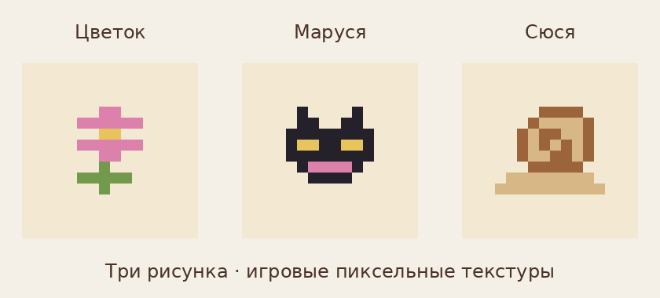

# Характер и маленькие истории — 0.22.0-alpha

## Домашние варианты

| Друг | Варианты | Переключение |
|---|---|---|
| Дюдюнька | Цветок, портрет Маруси, портрет Сюси | По очереди при начале занятия у своего столика |
| Маруся | Клубком, мордочка к лапам, одна лапка вперёд | По очереди при начале занятия у своей лежанки |
| Сюся | Спокойные, заинтересованные, втянутые усики | Сервер пересчитывает реакцию каждые 10 тиков |

Сюся проявляет интерес, когда выглядывает, идёт к растению или перекусывает; также при виде любимой еды в любой руке своего живого владельца в пределах 3 блоков и прямой видимости. Вода, дождь, укрытие и сон имеют приоритет и втягивают усики. Еда этой реакцией не расходуется, доверие не начисляется.

Варианты рисунков и поз сохраняются в NBT `CharacterVariant` / `NextCharacterVariant`; старые сущности начинают с 0, значения ограничены 0–2. Реакция усиков временная, после загрузки пересчитывается. Состояние столика `picture` 0–2 сохраняет последний рисунок. Выбор варианта не использует случайные числа. Навигация, завершившая путь менее чем в блоке от точки подхода, дополняется шагом до 0,04 блока с проверкой столкновений. Модели всех трёх возрастов поддерживают варианты; размеры сущности и текущая последовательность занятий сохранены.

## Две истории

«Кошка, которая выбрала дом»: следы Маруси на подоконнике → знакомство с подушкой и листом рисунка → когтеточка и кошачье одобрение → тихое мурчание дома.

«Большое путешествие маленькой Сюси»: записка на листочке → неспешная дорога по мху → разумный путь к листочку после дождя → уютный домик и семейное приветствие.

Истории остаются текстовыми; в 0.23.0 добавлены независимые совместные AI-сценки у мебели (FURNITURE-VISITS.md). У каждой истории четыре страницы: начало доступно сразу, три продолжения открываются прочитанными записками. Поздняя записка сохраняется сразу, но текст продолжения скрыт до предыдущих страниц. Путевые подсказки остаются доступны. Прогресс личный, сохраняется на сервере по UUID, передача альбома не передаёт историю.

| Предметы | Обычные места | Дополнительные места |
|---|---|---|
| `marusya_note_1`, `_2`, `_3` | Дома деревень plains/desert/savanna/snowy/taiga | Шахты, лесные особняки; `mvs:abandoned`; common сундуки skeleton/zombie dungeon в Better Dungeons |
| `syusya_note_1`, `_2`, `_3` | Те же пять типов домов деревень | Обычные подземелья; `mvs:swamps`; loot_piles в small dungeon Better Dungeons |

В каждом поддерживаемом сундуке отдельный шанс для страниц 1/2/3: **20% / 15% / 10%**. Сундук может содержать несколько разных записок. Дополнительные моды не обязательны; альбом использует флаги сервера. Лут добавляется только при первом формировании сундука. Существующий `trailNotes` отключает добавление всех записок; прочитанное остаётся доступно.

Глобальный модификатор `friend_notes` использует отдельный детерминированный бросок от зерна мира, положения сундука и номера записки; не расходует RNG исходного лута и не добавляет повтор своего предмета. Исходные три записки Дюдюньки, их маршруты и шансы сохранены. Новые записки не имеют рецептов, не требуют дружбы и не дают наград.

В сохранении первые три бита `TrailProgress` по-прежнему относятся к Дюдюньке, следующие три — к Марусе, последние три — к Сюсе (маска 0–511). Альбом содержит 18 страниц путеводителя/историй; протокол 7 использует VarInt для маски и передаёт вариант/реакцию каждого друга. Требуется одинаковая версия на клиентах и сервере.

## Воспроизводимые ресурсы

`python tools/generate_furniture.py`, затем `python tools/generate_character_moments.py` создают мебель, варианты рисунков, геометрию мотивов и иконки шести записок. Затем `gradle verifyModels` и `python tools/preview_character_moments.py` создают превью настоящих возрастных моделей; `python tools/preview_furniture.py` проверяет варианты мебели. Новых библиотек во время игры нет.

